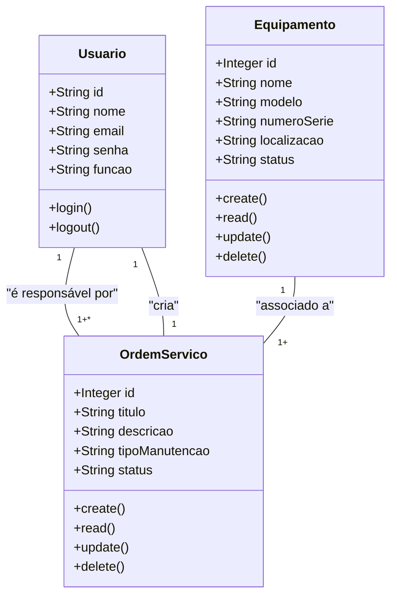
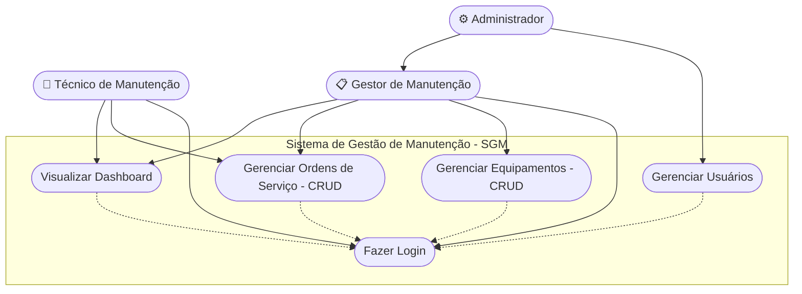
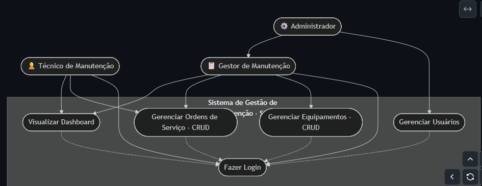
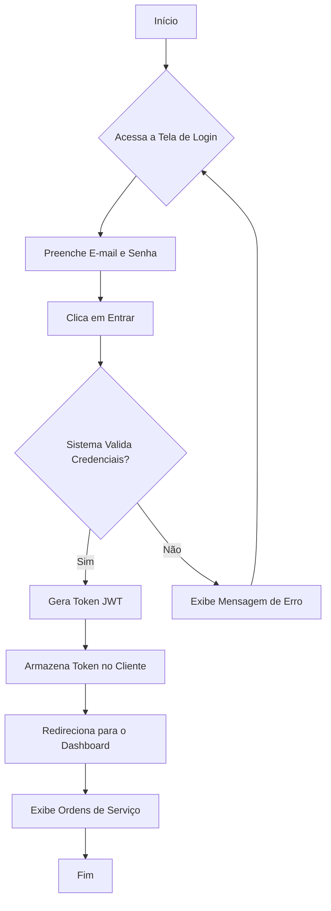
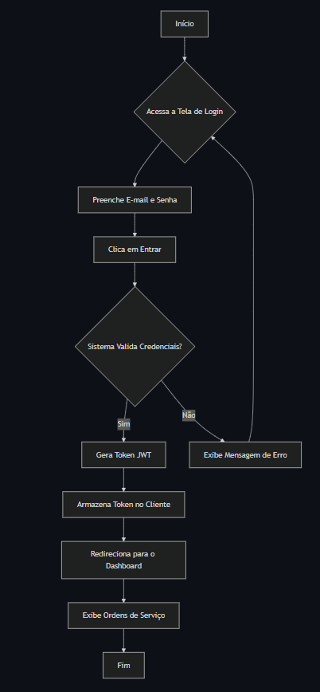

# Sistema de Gestão de Manutenção (Formativa)

# Briefing

## Visão Geral do Projeto
O projeto consiste no desenvolvimento de um Sistema de Gestão de Manutenção (SGM) no formato de uma aplicação web. O objetivo é centralizar e otimizar o controle das atividades de manutenção de máquinas e equipamentos de uma empresa. A plataforma permitirá o cadastro de equipamentos, agendamento de manutenções preventivas e corretivas, e o gerenciamento de ordens de serviço.

## Escopo

- ### Objetivos:
    - Centralizar Informações: Unificar os dados sobre equipamentos e manutenções em um único local.
    - Otimizar Processos: Agilizar a abertura, atribuição e finalização de ordens de serviço.
    - Melhorar a Tomada de Decisão: Fornecer um histórico detalhado de manutenções por equipamento para análises futuras.
    - Aumentar a Produtividade: Reduzir o tempo de inatividade dos equipamentos através de um gerenciamento mais eficaz.
    - Garantir a Segurança: Proteger o acesso e os dados do sistema com autenticação moderna e segura.

- ### Público-Alvo:
    - Técnicos de Manutenção: Responsáveis pela execução e atualização das ordens de serviço.
    - Gestores de Manutenção: Encarregados de planejar, delegar e supervisionar as atividades de manutenção.
    - Administradores do Sistema: Responsáveis pela gestão de usuários e permissões.

- ### Recursos Tecnológicos:

## Diagramas (Mermaid, Miro, Draw.io)

1. ### Diagrama de Classes
Este diagrama modela as principais entidades do sistema: Usuario (Usuário), Equipamento (Equipamento) e OrdemServico (Ordem de Serviço), mostrando seus atributos e os relacionamentos entre elas.

```mermaid

    classDiagram 
        class Usuario {
            +String id
            +String nome
            +String email
            +String senha
            +String funcao
            +login()
            +logout()
        }

        class Equipamento {
            +Integer id
            +String nome
            +String modelo
            +String numeroSerie
            +String localizacao
            +String status
            +create()
            +read()
            +update()
            +delete()
        }

        class OrdemServico {
            +Integer id
            +String titulo
            +String descricao
            +String tipoManutencao
            +String status
            +create()
            +read()
            +update()
            +delete()
        }

        Usuario "1" -- "1+*" OrdemServico : "é responsável por"
        Equipamento "1" -- "1+" OrdemServico : "associado a"
        Usuario "1" -- "1" OrdemServico : "cria"
```

#### Explicação:
- Um Usuario (Técnico) pode ser responsável por várias OrdemServico (Ordens de Serviço).
-  Um Equipamento (Equipamento) pode estar associado a várias OrdemServico.
- Uma OrdemServico é criada por um Usuario (Gestor ou Administrador) e está associada a exatamente um equipamento e um técnico responsável.

2. ### Diagrama de Casos de Uso
Este diagrama ilustra as interações dos diferentes tipos de usuários (atores) com as funcionalidades do sistema.

```mermaid

graph TD
    subgraph "Sistema de Gestão de Manutenção - SGM"
        uc1([Fazer Login])
        uc2([Gerenciar Equipamentos - CRUD])
        uc3([Gerenciar Ordens de Serviço - CRUD])
        uc4([Visualizar Dashboard])
        uc5([Gerenciar Usuários])
    end

    Tecnico([👷 Técnico de Manutenção])
    Gestor([📋 Gestor de Manutenção])
    Admin([⚙️ Administrador])

    Tecnico --> uc1
    Tecnico --> uc3
    Tecnico --> uc4

    Gestor --> uc1
    Gestor --> uc2
    Gestor --> uc3
    Gestor --> uc4

    Admin --> uc5
    Admin --> Gestor

    uc3 -.-> uc1
    uc2 -.-> uc1
    uc4 -.-> uc1
    uc5 -.-> uc1

```

#### Explicação:
- Atores: Técnico, Gestor e Administrador.

#### Casos de Uso:
- Técnico: Pode fazer login, gerenciar (visualizar e atualizar status) ordens de serviço e visualizar o dashboard.
- Gestor de Manutenção: Tem as mesmas permissões do técnico e, adicionalmente, pode gerenciar (criar, editar, excluir) equipamentos e ordens de serviço.
- Administrador: Herda as permissões do gestor e também pode gerenciar usuários.
- Relação include: Para acessar qualquer funcionalidade principal (gerenciar equipamentos, ordens, etc.), o usuário deve primeiro "Fazer Login".

3. ### Diagrama de Fluxo (Login e Acesso ao Dashboard)
Este diagrama detalha o processo passo a passo que um usuário segue para se autenticar no sistema e acessar o dashboard principal.

```mermaid

graph TD
    A[Início] --> B{Acessa a Tela de Login}
    B --> C[Preenche E-mail e Senha]
    C --> D[Clica em Entrar]
    D --> E{Sistema Valida Credenciais?}
    E -- Sim --> F[Gera Token JWT]
    F --> G[Armazena Token no Cliente]
    G --> H[Redireciona para o Dashboard]
    H --> I[Exibe Ordens de Serviço]
    I --> J[Fim]
    E -- Não --> K[Exibe Mensagem de Erro]
    K --> B

```

#### Explicação:

- O fluxo começa quando o usuário acessa a tela de login.
- Ele insere suas credenciais (e-mail e senha).
- O sistema verifica se as credenciais são válidas.
    - Se sim: Um token de autenticação (JWT) é gerado, armazenado no navegador do cliente, e o usuário é redirecionado para o dashboard, onde os dados são exibidos.
    - Se não: Uma mensagem de erro é exibida, e o usuário permanece na tela de login para tentar novamente.

## Análise de Risco

# Matriz de Análise de Risco do Projeto SGM

A tabela abaixo apresenta os riscos identificados no projeto **SGM**, organizados por categoria, junto com a probabilidade, impacto e estratégias de mitigação propostas.

---

## Riscos Técnicos

| ID  | Risco                    | Probabilidade | Impacto | Mitigação |
|-----|--------------------------|---------------|---------|-----------|
| 1   | Chave secreta do JWT comprometida         | Média         | Alto    | Utilizar chaves secretas longas e complexas, armazená-las em variáveis de ambiente e implementar política de rotação de chaves. |
| 2   | Vulnerabilidade de truncamento do Bcrypt  | Baixa         | Alto    | Garantir que a entrada para o hashing de senha nunca exceda 72 bytes e tratar a senha de forma isolada, sem concatenação. |
| 3   | Lentidão do sistema com aumento de dados  | Média         | Média   | Otimizar consultas com indexação, implementar paginação e planejar arquitetura para escalabilidade futura. |
| 4   | Código de baixa qualidade com bugs        | Alta          | Média   | Adotar práticas de código limpo, revisões de código (code review) e testes unitários e de integração contínua. |

---

## Riscos de Gerenciamento

| ID  | Risco                             | Probabilidade | Impacto | Mitigação |
|-----|-----------------------------------|---------------|---------|-----------|
| 5   | Aumento do escopo (Scope Creep)   | Alta          | Média   | Formalizar processo de controle de mudanças e avaliar impacto em prazo/custo antes da aprovação. |
| 6   | Atraso na entrega do projeto      | Alta          | Média   | Utilizar metodologias ágeis, reavaliar cronograma a cada sprint e manter comunicação transparente sobre progresso. |
| 7   | Requisitos mal interpretados      | Média         | Alto    | Validar protótipos e wireframes com usuários finais e manter comunicação constante para esclarecimento. |

---

## Riscos Organizacionais

| ID  | Risco                                    | Probabilidade | Impacto | Mitigação |
|-----|------------------------------------------|---------------|---------|-----------|
| 8   | Resistência dos usuários à nova ferramenta | Média       | Alto    | Envolver usuários-chave desde o início, criar interface amigável (UI/UX) e comunicar benefícios do sistema. |
| 9   | Inserção de dados incorretos no sistema  | Média         | Alto    | Implementar validações robustas nos formulários e, se possível, importar/validar dados existentes. |
| 10  | Falta de treinamento para os usuários    | Média         | Média   | Criar manuais de usuário, realizar treinamentos práticos por perfil (técnico, gestor, administrador) e oferecer suporte. |

---

## Prototipagem

## Codificação

